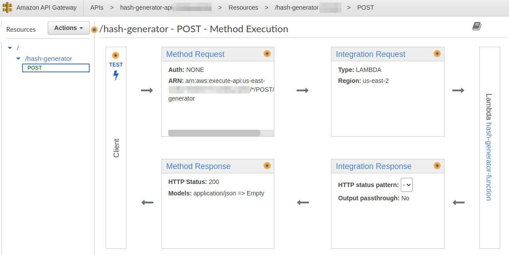

# ITJ. Staff Full Stack – Backend code challenge

Instructions can be found [here](./FullStackChallenge.docx%20(1).pdf)

**Prerequisites:**
- Java +1.8
- Maven +3.9.x
- AWS CLI v2
- jq
- Python +3.x

## 1_anagram_checker
Inside the [1_anagram_checker/anagram_checker/](./1_anagram_checker/anagram_checker) folder the `AnagramChecker.java` class contains all the solution to this part of the challenge. Additionally the `AnagramCheckerTest.java` contains several test cases included the provided one and many other popular anagrams. The generated jar could be downloaded [here](./_resources/anagram-checker-1.0.jar).

As a plus, I developed the same solution with the python language and also the same unit tests. All that code can be found in the [1_anagram_checker/anagrams.py](./1_anagram_checker/anagrams.py) python script and can be executed with the following command:

```sh
python ./1_anagram_checker/anagrams.py
```

## 2_balanced_parenthesis
Inside the [2_balanced_parenthesis/balanced-parenthesis/](./2_balanced_parenthesis/balanced-parenthesis/) folder  the `BalancedParenthesis.java` class contains all the solution to this part of the challenge. Additionally in the `BalancedParenthesisTest.java` there are many test cases that covers several kind of inputs. Also the generated jar could be downloaded [here](./_resources/balanced-parenthesis-1.0.jar).

## 3_hash_generator
As the instruccions request, a simple app was developed using Java as programming language. The code could be reviewed in the [3_hash_generator/hash-generator/](./3_hash_generator/hash-generator/) folder.

```
3_hash_generator/
├── deploy # folder with resources to deploy to aws-cloud infrastructure
│   ├── aws-setup.sh # bash script to create Lambda function and REST API Gateway
│   ├── lambda-role-policy.json
│   └── settings.sh # environment variables
└── hash-generator #
    ├── pom.xml
    ├── src
    └── target
```

The Java project contains the `MainFunction.java` class to handle lambda requests and `services/HashGenerator.java` class to validate rules and generate sha256 hash only if the input meets the requirements. Also the fat-jar generated could be downloaded [here](_resources/hash-generator-1.0.jar).

In the [3_hash_generator/deploy](./3_hash_generator/deploy) folder there are all the resources necessary for deployment in aws-cloud using aws-cli. Only is necessary to run [aws-setup.sh](./3_hash_generator/deploy/aws-setup.sh) bash script.

The following diagram shows the relationship between the REST API (API Gateway) and the Lambda Function both part of the solution of HashGenerator.



The OpenAPI 3.0 documentation can be viewed [here](https://app.swaggerhub.com/apis-docs/angelgarcan/HashGenerator/v1#/default/post_hash_generator) (sensitive data was removed) and the corresponding YAML file can be found in the [3_hash_generator/deploy/hash-generator-api-dev-oas30.yaml](./3_hash_generator/deploy/hash-generator-api-dev-oas30.yaml) file.

**HashGenerator API REST Test Results**
You can send a request to the lambda function via the API Gateway with the following curl command:

```bash
TEST_PASSWORD="Password123#" ; curl -s -X POST -H \"Content-Type: application/json\" -d '{\"input\": \"'$TEST_PASSWORD'\"}' https://$API_GATEWAY_ID.execute-api.$AWS_REGION.amazonaws.com/dev/$API_GATEWAY_RESOURCE_NAME
```

Following are the corresponding responses for several inputs:
```
OK      Password123#    -> {"hash":"d6b02a68f3081f455b826185a24d94f8df127e188c93bad01ddcccce794a4e8b"}
OK      abcd-1234       -> {"hash":"56f763b09645e6a984d3d6aad4be8b9cac55c0f491bf99b025932669e9eb25d6"}
FAIL    a1+             -> {"error":"Invalid input. The string must consist of at least 8 characters, at least one number, and at least one special character"}
FAIL    password        -> {"error":"Invalid input. The string must consist of at least 8 characters, at least one number, and at least one special character"}
FAIL    1234567890      -> {"error":"Invalid input. The string must consist of at least 8 characters, at least one number, and at least one special character"}
FAIL    test1234        -> {"error":"Invalid input. The string must consist of at least 8 characters, at least one number, and at least one special character"}
FAIL    another_pass&   -> {"error":"Invalid input. The string must consist of at least 8 characters, at least one number, and at least one special character"}
```

References:
- https://awscli.amazonaws.com/v2/documentation/api/latest/reference/index.html#cli-aws